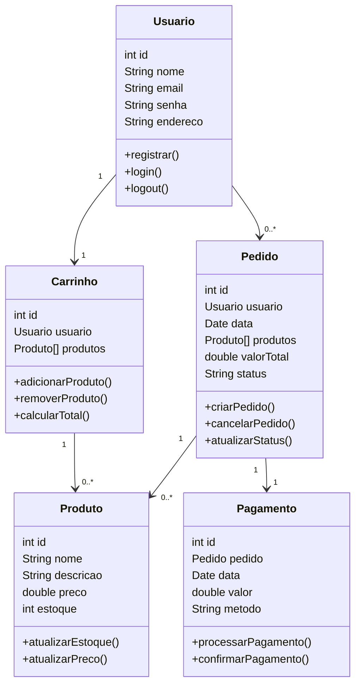

## Diagrama de classe

O Projeto será composto pelas seguintes Classes:

```mermaid
classDiagram
class Usuario {
int id
String nome
String email
String senha
String endereco
+registrar()
+login()
+logout()
}

    class Produto {
        int id
        String nome
        String descricao
        double preco
        int estoque
        +atualizarEstoque()
        +atualizarPreco()
    }

    class Carrinho {
        int id
        Usuario usuario
        Produto[] produtos
        +adicionarProduto()
        +removerProduto()
        +calcularTotal()
    }

    class Pedido {
        int id
        Usuario usuario
        Date data
        Produto[] produtos
        double valorTotal
        String status
        +criarPedido()
        +cancelarPedido()
        +atualizarStatus()
    }

    class Pagamento {
        int id
        Pedido pedido
        Date data
        double valor
        String metodo
        +processarPagamento()
        +confirmarPagamento()
    }

    Usuario "1" --> "0..*" Pedido
    Usuario "1" --> "1" Carrinho
    Carrinho "1" --> "0..*" Produto
    Pedido "1" --> "0..*" Produto
    Pedido "1" --> "1" Pagamento
```